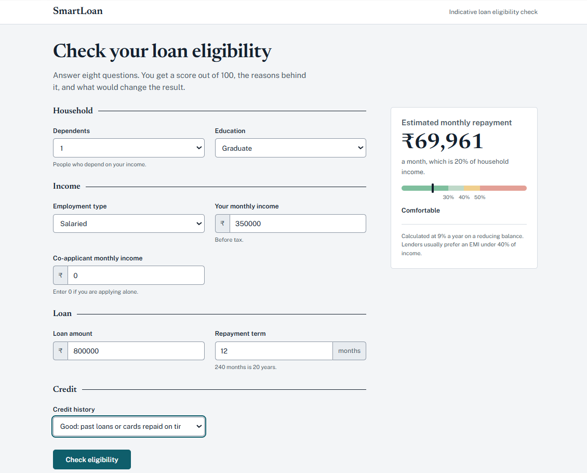
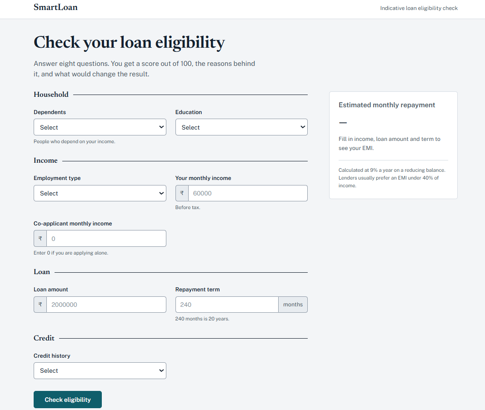
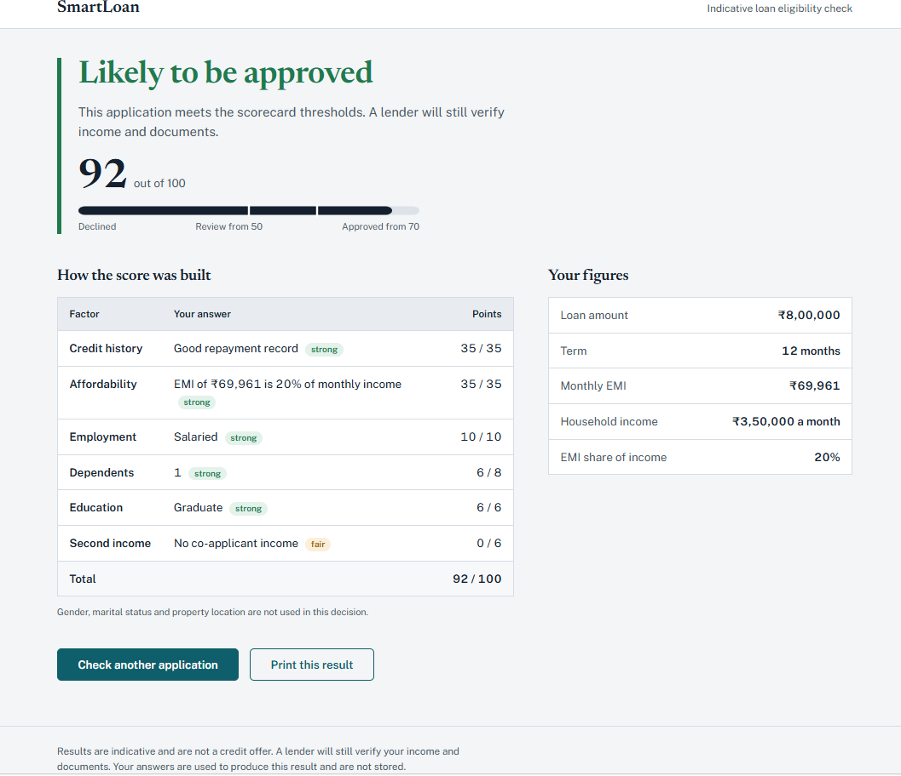

# SmartLoan Predictor


A Flask web application that estimates how likely a loan application is to be approved and explains why. Each application is scored on a transparent 100-point scorecard. The result shows the points behind every factor and what would improve the outcome.

---

## Screenshots

| Application form | Live repayment preview | Result |
|---|---|---|
|  |  |  |

## Overview

Many loan-prediction demos return a bare "approved" or "rejected" from a black-box model. This project takes a different approach:

- The decision comes from an auditable scorecard, so every result can be explained factor by factor.
- Fairness is part of the design. Gender, marital status and property location are not used.
- A machine-learning model is optional and is shown only as a second opinion.

The project started with a Random Forest model that approved every applicant and ignored credit history. It was replaced by the scorecard, and a training script now checks that any new model responds to credit history before it is used.

## Features

- **Explainable decisions.** Six factors with visible points, plus the rule that capped the result when one applied.
- **Live repayment preview.** The EMI and its share of income update as the user types, using the same formula as the backend.
- **Actionable feedback.** Weak applications get specific advice, such as the loan size that keeps the EMI at 40% of income.
- **Input validation.** Invalid or missing values reopen the form with clear messages and preserve what was entered.
- **Optional ML signal.** A model trained with `train_model.py` adds an approval probability next to the scorecard.
- **Production basics.** Application factory, `/health` endpoint, security headers (CSP, frame and content-type protection), gunicorn, Dockerfile, no personal data in logs, and an automated test suite.

## How the decision works

| Factor | Max points | Rule |
|---|---|---|
| Credit history | 35 | 35 for a good record, 0 otherwise |
| Affordability | 35 | EMI as a share of monthly income: up to 30% scores 35, up to 40% scores 28, up to 50% scores 18, up to 60% scores 8, above 60% scores 0 |
| Employment | 10 | Salaried 10, self-employed 6 |
| Dependents | 8 | None 8, one 6, two 4, three or more 2 |
| Education | 6 | Graduate 6, otherwise 3 |
| Second income | 6 | 6 if a co-applicant has income |

**Outcome:** a score of 70 or more is approved, 50 to 69 goes to manual review, and below 50 is declined.

Hard limits apply on top of the score:

- No credit history can never be approved automatically (maximum outcome: review).
- An EMI above 50% of income can never be approved (maximum outcome: review).
- An EMI above 60% of income is always declined.

The EMI uses the standard reducing-balance formula at an assumed annual rate, 9% by default and configurable with `ANNUAL_INTEREST_RATE`.

## Tech stack

| Area | Tools |
|---|---|
| Backend | Python 3.11+, Flask 3.1, Jinja2 |
| Machine learning | scikit-learn, pandas, NumPy, joblib |
| Frontend | HTML, CSS, vanilla JavaScript |
| Serving | gunicorn, Docker |
| Testing | pytest |

## Project structure

```
smartloan-predictor/
├── app.py                 # Flask app factory, validation, routes
├── scoring.py             # Scorecard, EMI maths, improvement tips
├── ml.py                  # Optional model: features, loading, prediction
├── train_model.py         # Train and evaluate the optional model
├── templates/             # Base layout, form, result, error pages
├── static/
│   ├── css/style.css
│   └── js/app.js          # Live EMI preview
├── tests/                 # Scoring, app and training tests
├── Screenshots/           # Images used in this README
├── requirements.txt       # Pinned runtime dependencies
├── requirements-dev.txt   # Adds pytest
└── Dockerfile
```

## Getting started

Requires Python 3.11 or newer.

```bash
git clone https://github.com/Gayathri-Reddy874/smartloan-predictor.git
cd smartloan-predictor

python -m venv .venv
source .venv/bin/activate        # Windows: .venv\Scripts\activate
pip install -r requirements.txt

flask --app app run --debug      # http://127.0.0.1:5000
```

### Docker

```bash
docker build -t smartloan-predictor .
docker run -p 8000:8000 smartloan-predictor      # http://localhost:8000
```

### Production

```bash
gunicorn --bind 0.0.0.0:8000 --workers 2 app:app
```

## Configuration

| Variable | Default | Purpose |
|---|---|---|
| `ANNUAL_INTEREST_RATE` | `9.0` | Rate (% a year) used for EMI and affordability |
| `MODEL_PATH` | `models/loan_model.joblib` | Location of the optional model |
| `LOG_LEVEL` | `INFO` | Python logging level |
| `FLASK_DEBUG` | unset | Set to `1` for debug mode when running `python app.py` |

## Optional: train the statistical model

1. Download the public Loan Prediction dataset (it has a `Loan_Status` column of `Y` and `N`) and save it as `data/train.csv`. Create the `data` folder if it does not exist.
2. Train the model:

   ```bash
   python train_model.py --data data/train.csv
   ```

3. Restart the app. The result page now shows the model's approval likelihood next to the scorecard.

The script compares logistic regression and a random forest using 5-fold cross-validation and keeps the better one. It reports accuracy, precision, recall, F1, ROC-AUC and the confusion matrix on a held-out 20% test set, then saves `models/loan_model.joblib` and `models/loan_model.metrics.json`. It also warns if the model barely reacts to credit history. A model trained with a different scikit-learn version is ignored with a warning, so retrain after upgrading.

## Testing

```bash
pip install -r requirements-dev.txt
pytest
```

The 30 tests cover EMI maths, scorecard rules and caps, form validation, security headers, the health endpoint and the training pipeline.

## Limitations

- This is a demonstration project. It is not a credit decision and must not be used to approve or refuse real loans.
- Scorecard weights are set by hand for transparency and are not fitted to lender outcomes.
- Income is treated as monthly and in rupees. The interest rate is a single assumption, not a product rate.
- The public training dataset is small, so any model trained on it is indicative only.

## Roadmap

- Fit scorecard weights from data and compare them with the model
- SHAP explanations for the statistical model
- GitHub Actions workflow to run the tests on every push

## Author

**Mallareddygari Gayathri**

B.E. in AI/ML Engineering, Bengaluru, India

Data Science intern and aspiring Data Analyst, moving toward Data Scientist and AI/ML Engineer roles.

GitHub: [@Gayathri-Reddy874](https://github.com/Gayathri-Reddy874)
